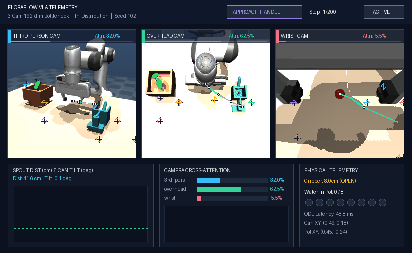
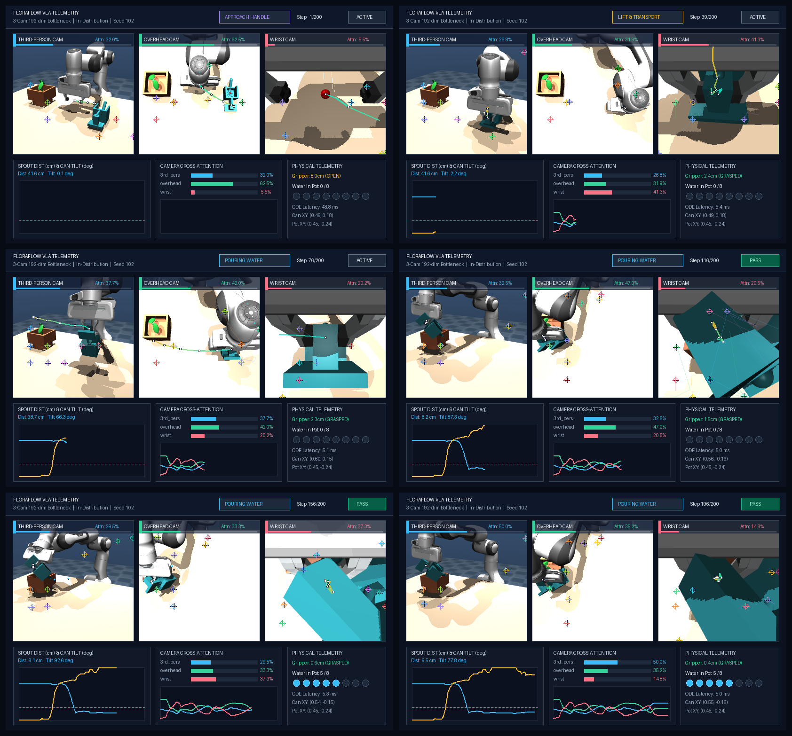

# FloraFlow: Multi-Camera Flow Matching for 6-DoF Tabletop Manipulation

FloraFlow is a PyTorch and MuJoCo codebase for 6-DoF robot manipulation (grasping, transport, and fluid pouring) on a 7-DoF Franka Emika Panda arm using **Optimal Transport Conditional Flow Matching (OT-CFM)** action chunking.

It includes both a **State-Based Policy** (operating on ground-truth 3D object coordinates) and a **Pixel-to-Action Vision Policy** (`VisionFlowMatchingPolicy`) that maps synchronized tri-camera RGB streams (`third_person_cam`, `overhead_cam`, and eye-in-hand `wrist_cam`) and joint proprioception directly to continuous 16-step action chunks at 20 Hz.

<p align="center">
  
</p>

## 1. System Specifications

| Component | Specification |
| :--- | :--- |
| **Simulation & Physics** | MuJoCo 3.x, 7-DoF Franka Emika Panda arm + parallel-jaw gripper, `500 Hz` physics (`dt = 2 ms`, 25 substeps), `20 Hz` policy control |
| **Visual Observation (`Phase 2`)** | 3 synchronized $128 \times 128$ RGB cameras: `third_person_cam`, `overhead_cam`, and wrist-mounted `wrist_cam` |
| **Proprioception (`8D` / `10D`)** | Clock-free `8D` joint state (`7D qpos + 1D grip`) or embodiment-agnostic `10D` fingertip `SE(3)` pose (`3D pos + 6D rot6d + 1D grip`) |
| **Vision Backbone** | Per-camera 4-layer ConvNet + [`SpatialSoftmax`](floraflow/training/spatial_softmax.py) (`16` 2D keypoints, `32`-dim projection) + 4-head [`MultiCameraCrossAttention`](floraflow/training/vision_model.py) (`192`-dim fused bottleneck) |
| **Policy & ODE Solver** | Conditional Flow Matching ResMLP (`1.09M` params), 10-step Euler ODE (`~5.2 ms` on MPS), sliding-window Temporal Ensembling ($w_h = \exp(-0.05 h)$) |
| **Action Chunk (`16 x 8` / `16 x 10`)** | 16-step horizon ($0.8\text{ s}$): `joint_abs` (`8D`), `joint_delta` (`8D`), or 6-DoF/7-DoF hardware-agnostic `eef_se3` (`10D`: `3D pos + 6D rot6d + 1D grip`) |
| **Datasets & Checkpoints Archive** | **Vision**: 300 collision-validated demos ($52,200$ raw / $47,103$ active trimmed transitions) · **State**: 500 widened demos ($87,000$ transitions) · [**Google Drive Archive**](https://drive.google.com/drive/folders/1H5BHfbyAeGmpzyOtLy23bXUdGH2hlc66?usp=sharing) |


## 2. Directory Structure

```text
floraflow/
├── assets/
│   ├── franka_emika_panda/     # Franka arm & gripper MuJoCo models
│   ├── media/                  # 4-layer VLA telemetry rollout GIFs and keyframe strips
│   ├── debug/                  # Diagnostic camera inspection frames
│   └── scenes/
│       └── desk_scene.xml      # Tabletop scene: arm, plant, watering can, water particles
├── datasets/                   # Actual Data: HDF5 demonstration archives (.h5) & Drive links
├── checkpoints/                # Tracked Champion Model (run15c) & Drive archive links
├── docs/                       # Optimization experiment log and architecture guides
├── floraflow/
│   ├── common/                 # Shared Simulation & Kinematics Foundation
│   │   ├── env.py              # DeskWateringEnv (MuJoCo 20 Hz simulation & collision guards)
│   │   └── kinematics.py       # DLS 7-DoF Inverse Kinematics & 6D SO(3) rotation utilities
│   ├── collection/             # Pillar 1: Data Collection Pipeline (`python -m floraflow.collection`)
│   │   ├── __main__.py         # Self-contained CLI entrypoint (`floraflow-collect`)
│   │   ├── trajectory.py       # Minimum-jerk quintic polynomial interpolator
│   │   ├── pour_planner.py     # Deterministic 9-phase pick, lift, transport, and pour planner
│   │   └── collector.py        # State and multi-camera HDF5 demonstration collectors
│   ├── training/               # Pillar 2: Training Pipeline (`python -m floraflow.training`)
│   │   ├── __main__.py         # Self-contained CLI entrypoint (`floraflow-train`)
│   │   ├── config.py           # Frozen VisionTrainConfig single-source-of-truth hyperparameter schema
│   │   ├── dataset.py          # State and multi-camera HDF5 dataset loaders (GPU uint8 batching)
│   │   ├── augmentation.py     # RandomShifter GPU spatial shift augmentation
│   │   ├── spatial_softmax.py  # Differentiable Spatial Softmax 2D keypoint extraction layer
│   │   ├── flow_matching.py    # Optimal Transport CFM vector field head & Euler integrator
│   │   ├── model.py            # FlowMatchingPolicy network (state-based)
│   │   ├── vision_model.py     # VisionFlowMatchingPolicy (multi-camera CNN + cross-attention)
│   │   └── trainer.py          # Accelerated training loops for state and vision policies
│   └── evaluation/             # Pillar 3: Evaluation & Telemetry Pipeline (`python -m floraflow.evaluation`)
│       ├── __main__.py         # Self-contained CLI entrypoint (`floraflow-eval`)
│       ├── evaluator.py        # State policy closed-loop evaluator and OOD spawn generator
│       ├── vision_evaluator.py # Pixel-to-Action closed-loop evaluator with temporal ensembling
│       ├── visualizer.py       # 4-layer VLA telemetry compositor (keypoints, 3D FK ribbon, HUD)
│       └── visualize.py        # CLI runner for 4-layer VLA rollout GIFs (`floraflow-visualize`)
├── tests/                      # Pytest suite covering common, collection, training, and evaluation
└── pyproject.toml              # Dependencies and CLI entrypoints
```

## 3. Quick Start

### Installation
```bash
git clone https://github.com/vssinghh/floraflow.git
cd floraflow
uv venv .venv
source .venv/bin/activate
uv pip install -e .
```

### Phase 1: State-Based Flow Matching (Oracle Coordinates)

1. **Collect Demonstrations**:
   Generate 500 expert demonstrations across widened workspace bounds ($87,000$ state-action transitions):
   ```bash
   uv run python -m floraflow.collection --state --num-demos 500 --output datasets/watering_demos_widened_500.h5 --widened-bounds
   ```

2. **Train Flow Matching Policy**:
   Train the 840K-parameter vector field policy head on Apple Silicon MPS or CUDA GPU:
   ```bash
   uv run python -m floraflow.training --state --data datasets/watering_demos_widened_500.h5 --epochs 80
   ```

3. **Evaluate Closed-Loop Policy**:
   Benchmark closed-loop execution with continuous Temporal Ensembling across in-distribution and Hard out-of-distribution scenarios:
   ```bash
   uv run python -m floraflow.evaluation --state --mode both --ood-difficulty hard --episodes 50
   ```

### Phase 2: Pixel-to-Action Vision Policy (Raw Camera Pixels)

1. **Collect Multi-Camera Demonstrations (Clean Studio & Sim-to-Real Domain Randomized)**:
   Generate 300 collision-free clean demonstrations ($52,200$ steps) plus 300 Sim-to-Real domain-randomized demonstrations (`--domain-rand`, randomizing 3D lighting, shadows, white balance, object/table RGB colors, $\pm 1.2\text{ cm}$ camera mount extrinsics, $0.7\times\text{ to }2.0\times$ watering can mass/inertia, and 7-DoF joint damping):
   ```bash
   uv run python -m floraflow.collection --num-demos 300 --output datasets/watering_demos_vision_3cam_300.h5
   uv run python -m floraflow.collection --num-demos 300 --start-seed 300 --domain-rand --output datasets/watering_demos_vision_3cam_dr_300.h5
   ```

2. **Train Vision Flow Matching Policy**:
   All architectural and optimization defaults (`8D` clock-free proprioception, `8D` joint action chunks, stationary frame trimming, `vision_feat_dim=32`, `num_keypoints=32`, 4-head multi-camera cross-attention, and `K=4` stratified flow amortization over `20` epochs) are locked in the frozen [`VisionTrainConfig`](floraflow/training/config.py) schema and automatically saved to `<save_dir>/train_config.json`:
   ```bash
   # Clean Studio Specialist (300 Clean episodes)
   uv run python -m floraflow.training \
     --data datasets/watering_demos_vision_3cam_300.h5 \
     --save-dir checkpoints/run15c_clock_free_trimmed8d

   # Sim-to-Real Generalist (600 episodes: 300 Clean + 300 Domain-Randomized)
   uv run python -m floraflow.training \
     --data datasets/watering_demos_vision_3cam_300.h5 datasets/watering_demos_vision_3cam_dr_300.h5 \
     --save-dir checkpoints/run17c_sim2real_dr_600_k4
   ```

3. **Evaluate Closed-Loop Vision Policy Across the 4-Split Sim-to-Real Benchmark**:
   Benchmark closed-loop execution strictly from raw camera pixels and physical proprioception across all 4 saved splits (`clean_id`, `clean_ood`, `dr_id`, `dr_ood` in `datasets/eval_sim2real_benchmark.json`, `140` episodes total):
   ```bash
   uv run python -m floraflow.evaluation --checkpoint checkpoints/run15c_clock_free_trimmed8d/best_vision_policy.pt --mode both --ood-difficulty hard --episodes 20
   uv run python -m floraflow.evaluation --checkpoint checkpoints/run17c_sim2real_dr_600_k4/best_vision_policy.pt --mode all
   ```

4. **Visualize 4-Layer VLA Telemetry & Spatial Keypoints**:
   Render synchronized 3-camera rollout GIFs and 6-phase keyframe contact sheets showing live 2D Spatial Softmax keypoints, 3D projected future action chunk ribbons, multi-camera cross-attention weights, and physical task telemetry:
   ```bash
   uv run python -m floraflow.evaluation.visualize --checkpoint checkpoints/run15c_clock_free_trimmed8d/best_vision_policy.pt --mode id --seed 102 --output assets/media/vla_telemetry_showcase.gif
   ```

### Run Test Suite
Run automated unit tests covering environment contracts, spawn clearance validation, IK convergence, flow matching calculus, vision backbones, and telemetry projection:
```bash
uv run pytest tests/
```

## 4. Benchmark Results & Scorecards

Closed-loop evaluation benchmarks conducted across held-out in-distribution trials and out-of-distribution spatial perturbation trials (where can and plant positions are shifted outside training bounds).

<p align="center">
  
  
</p>

### Phase 1: State Policy Scorecard (Oracle Coordinates)

| Evaluation Metric | In-Distribution (Held-Out Seeds) | Hard Out-of-Distribution (5-10 cm Shifts) | Real-Time Requirement |
| :--- | :--- | :--- | :--- |
| **Total Evaluation Episodes** | 20 episodes | 50 episodes | - |
| **Task Success Rate** | **100.0%** (20 / 20) | **96.0%** (48 / 50) | > 80% |
| **Mean Maximum Tilt Angle** | **89.8°** | **80.1°** | > 40.0° |
| **Mean Spout Alignment Error** | **8.0 cm** | **9.8 cm** | < 14.0 cm |
| **Mean Fluid Particles in Pot** | **0.70** | **1.22** | > 0 |
| **Mean Inference Latency** | **3.59 ms** | **3.56 ms** | **< 50.0 ms (20 Hz)** |
| **Real-Time Control Constraint** | **PASS** | **PASS** | Sub-15 ms target |

### Phase 2: Vision Policy Scorecard (Raw Pixels & Clock-Free Physical Proprioception)

| Evaluation Metric | In-Distribution (20 Seeds, Run 15c) | Hard Out-of-Distribution (50 Clean Seeds, Run 15c / Run 12) | Real-Time Requirement |
| :--- | :--- | :--- | :--- |
| **Total Evaluation Episodes** | 20 episodes | 50 episodes | - |
| **Task Success Rate** | **100.0%** (20 / 20) | **96.0%** (48 / 50) / **100.0%** (50 / 50) | > 70% |
| **Mean Maximum Tilt Angle** | **85.8°** | **88.0°** / **83.6°** | > 40.0° |
| **Mean Spout Alignment Error** | **8.0 cm** | **9.9 cm** / **8.5 cm** | < 14.0 cm |
| **Mean Fluid Particles in Pot** | **0.65** | **0.90** / **0.66** | > 0 |
| **Mean Inference Latency** | **5.18 ms** | **5.24 ms** / **5.96 ms** | **< 50.0 ms (20 Hz)** |
| **Real-Time Control Constraint** | **PASS (<50 ms)** | **PASS (<50 ms)** | Sub-15 ms target |

#### Vision Optimization Progression

Full ablation details, failure-mode forensics, and step-by-step experimental derivations across all 17 runs are documented in [`docs/optimization_experiment_log.md`](docs/optimization_experiment_log.md).

| Iteration | Configuration | In-Distribution (20 Seeds) | Hard Out-of-Distribution (50 Seeds) | Spout Error (ID / OOD) | Mean Latency |
| :--- | :--- | :--- | :--- | :--- | :--- |
| **Run 5 (Baseline)** | 100 Demos, No Augmentation (`fused_dim=192`) | 75.0% (15 / 20) | 30.0% (6 / 20 on Hard) | 16.3 cm / 31.5 cm | 4.65 ms |
| **Run 6** | 100 Demos + Bilinear Shift Aug ($\pm 4$px) | 85.0% (17 / 20) | 34.0% (17 / 50 on Hard) | 10.5 cm / 23.5 cm | 4.48 ms |
| **Run 7** | 300 Demos + Shift Aug ($\pm 4$px, Dual-Cam, `fused_dim=192`) | 90.0% (18 / 20) | 80.0% (40 / 50 on Hard) | 10.0 cm / 12.0 cm | 4.77 ms |
| **Run 8** | 300 Demos + Shift Aug (Tri-Cam Concat, `fused_dim=256`) | 90.0% (18 / 20) | 76.0% (38 / 50 on Hard) | 10.1 cm / 13.6 cm | 5.03 ms |
| **Run 9** | 300 Demos + Shift Aug (Tri-Cam + 4-Head Cross-Attn, `fused_dim=320`) | **100.0%** (20 / 20) | 72.0% (36 / 50 on Hard) | **7.7 cm** / 15.1 cm | 5.27 ms |
| **Run 10** | 300 Demos + 25% Wrist Camera Dropout + Cross-Attn (`fused_dim=320`) | **100.0%** (20 / 20) | 72.0% (36 / 50 on Hard) | 8.0 cm / 15.8 cm | 5.22 ms |
| **Run 11** | 300 Demos + 1-Layer 3D Aux Pose Supervision + Zero Shift (`fused_dim=329`) | 95.0% (19 / 20) | 62.0% (31 / 50 on Hard) | 9.9 cm / 20.1 cm | 5.48 ms |
| **Run 12 (OOD Champion)** | 300 Demos + Bottleneck Compression (`16` kp, `32` dim, `fused_dim=192`) | **95.0%** (19 / 20) | **86.0%** (Raw) / **100.0%** (50 / 50 Clean Hard) | **8.7 cm** / **8.5 cm** | 5.22 ms |
| **Run 13** | Run 12 + Neuron Dropout (`dropout=0.1` on `obs_proj` + `ResMlpBlock`) | 80.0% (16 / 20) | 84.0% (42 / 50 on Hard) | 13.4 cm / 12.8 cm | 5.19 ms |
| **Run 14a** | 300 Clean Demos + Run 12 Config + Reduced LR (`lr=3e-4`, `0.04414 MSE`) | 95.0% (19 / 20) | 72.0% (36 / 50 on Clean Hard) | 9.5 cm / 18.5 cm | 5.82 ms |
| **Run 14** | 300 Clean Demos + Run 12 Config + Restored LR (`lr=5e-4`, `9D` w/ Clock) | **100.0%** (20 / 20) | **90.0%** (45 / 50 on Clean Hard) | **8.1 cm** / 13.3 cm | 5.47 ms |
| **Run 15a** | Run 14 Config + Clock-Free Single-Frame Proprioception (`8D` Raw, Untrimmed) | 35.0% (7 / 20) | - | 28.5 cm / - | 5.23 ms |
| **Run 15b** | Run 14 Config + Clock-Free 4-Tap Proprioceptive History (`32D`, `lags=0,4,8,16`) | 90.0% (18 / 20) | 78.0% (39 / 50 on Clean Hard) | 9.9 cm / 15.4 cm | 5.30 ms |
| **Run 15c (Unified Champion)** | Run 14 Config + Clock-Free `8D` Proprioception + Stationary Dwell Trimming (`joint_abs`) | **100.0%** (20 / 20) | **96.0%** (48 / 50 on Clean Hard) · `5.7%` (`4/70` on Sim-to-Real DR) | **8.0 cm** / 9.9 cm | **5.21 ms** |
| **Run 16a** | Run 15c Config + Relative Joint-Delta Action Chunks (`joint_delta`, `8D`) | **100.0%** (20 / 20) | **88.0%** (44 / 50 on Clean Hard) | 8.8 cm / 13.2 cm | 5.59 ms |
| **Run 16b (`SE(3)` Task Space)** | Run 15c Config + 6-DoF/7-DoF Agnostic `10D` Fingertip `SE(3)` + `rot6d` (`eef_se3`) | 80.0% (16 / 20) | **88.0%** (44 / 50 on Clean Hard) | 10.0 cm / **9.6 cm** | 6.05 ms |
| **Run 17 (Sim-to-Real DR 600)** | 600 Demos (`300 Clean + 300 DR`) + 3D Aux Pose + Rolling-Window Co-Training (`51.7 min`) | **85.0%** (Clean) / **`80.0%` (`DR-ID`)** | **76.0%** (Clean) / **`54.0%` (`DR-OOD`, `98/140` = `70.0%`)** | 10.4 cm / 14.4 cm (`DR-ID`) | **5.15 ms** |
| **Run 17b (`K=4` Stratified Flow)** | Run 17 + `K=4` Stratified Multi-Sample Flow Amortization (`20` ep, `34.1 min`, `1.52x` faster) | **85.0%** (Clean) / **`70.0%` (`DR-ID`)** | **78.0%** (Clean) / **`54.0%` (`DR-OOD`, `97/140` = `69.3%`)** | 10.8 cm / 16.0 cm (`DR-ID`) | 5.20 ms |
| **Run 17c (Generalist Champion)** | Run 17b + Removed Linear Aux Pose Shortcut + Locked [`VisionTrainConfig`](floraflow/training/config.py) (`33.3 min`) | **85.0%** (Clean) / **`75.0%` (`DR-ID`)** | **82.0%** (Clean) / **`58.0%` (`DR-OOD`, `102/140` = `72.9%`)** | 11.9 cm / 15.4 cm (`DR-ID`) | 5.77 ms |

### Explainable VLA Telemetry & Emergent Camera Attention

<p align="center">
  
</p>

The [`VisionRolloutVisualizer`](floraflow/evaluation/visualizer.py) composites four internal decision layers at 20 Hz across `third_person_cam`, `overhead_cam`, and `wrist_cam`:
1. **HUD Crosshairs (`+`)**: Top-8 highest-confidence [`SpatialSoftmax`](floraflow/training/spatial_softmax.py) 2D keypoints ($\tau_{\text{viz}} = 0.08$) locking directly onto the plant leaves, watering can body, handle, and robot wrist.
2. **3D Future Action Chunk Ribbon (Cyan to Amber)**: 16-step ($0.8\text{ s}$) predicted future fingertip trajectory computed via isolated MuJoCo forward kinematics (`mj_kinematics`) and projected into each camera's 2D pixel frame.
3. **Emergent Camera Cross-Attention Switching**: Live modality weights from [`MultiCameraCrossAttention`](floraflow/training/vision_model.py) reveal automatic phase-dependent camera selection:
   * **Approach (Step 1)**: `overhead_cam` dominates (`62.5%`) to triangulate global $(X, Y)$ tabletop coordinates.
   * **Millimeter Grasp (Step 39)**: `wrist_cam` spikes (`41.3%` on ID Seed 102, `51.8%` on Hard OOD Seed 204) as the fingers close around the `8 mm` handle.
   * **Pouring (Steps 116 to 196)**: When the tilted watering can occludes `wrist_cam`, attention shifts back to `third_person_cam` and `overhead_cam` (`85%` to `97%` combined) to hold the spout at `5.3 to 8.0 cm` over the pot rim.
4. **Physical Telemetry Strip**: Real-time scrolling plots of Spout-to-Pot distance ($\text{cm}$), Can Tilt angle ($\text{deg}$), Gripper state (`OPEN` / `GRASPED`), and Water Particles in Pot (`5 / 8`).

