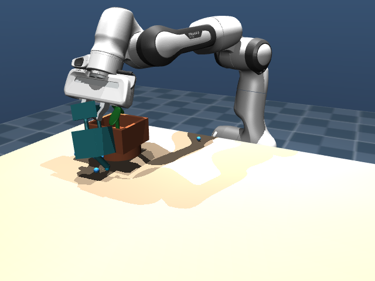
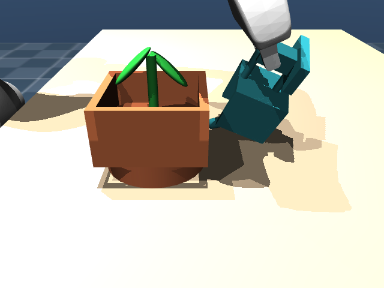

# FloraFlow: Minimalist Flow Matching Action Chunker for Tabletop Manipulation

`FloraFlow` is an end-to-end, cleanroom robotics system demonstrating 6-DoF object grasping, spatial transport, and fluid pouring using Optimal Transport Conditional Flow Matching (CFM) action chunking.

Built for the Franka Emika Panda robot arm in MuJoCo physics with zero external diffusion framework dependencies.

---

## 1. First-Principles Architecture

### What is it?
Conditional Flow Matching is a generative modeling framework that learns a continuous velocity vector field pushing a simple Gaussian noise distribution $p_0(x) = \mathcal{N}(0, I)$ directly onto an empirical trajectory distribution $p_1(x)$ along straight-line paths.

Instead of predicting single delta actions step by step, the policy predicts an entire future action chunk $X = [a_t, a_{t+1}, \dots, a_{t+H-1}] \in \mathbb{R}^{H \times D_{act}}$ ($H=16$, $D_{act}=8$) conditioned on current physical observations.

### Why do we use it?
Traditional behavioral cloning with Mean Squared Error suffers from the multimodality collapse problem: if an expert can reach around an obstacle from either the left or the right, MSE averages both trajectories, guiding the robot straight into the collision.

Standard Denoising Diffusion Probabilistic Models (DDPM) solve multimodality but require 50 to 100 iterative denoising steps along curved Brownian trajectories, imposing 100 to 500 ms of latency that violates real-time control constraints.

Optimal Transport Conditional Flow Matching defines straight-line probability paths:
$$x_t = (1 - (1 - \sigma_{min}) t) x_0 + t x_1$$
The target vector field velocity is constant along each sample path:
$$u_t(x_1 | x_0) = x_1 - (1 - \sigma_{min}) x_0$$
Because the paths are straight, numerical ODE integration converges in only 5 to 10 Euler steps, achieving sub-10 ms inference latencies well within the 50 ms deadline for 20 Hz control loops.

### How do we use it?
1. **Simulation & Synthesis**: Franka Panda arm manipulates a watering can on a table, transports it to a potted plant, and tilts the spout at 50 degrees to deposit water particles into the soil pot.
2. **Dataset Generation**: 100 deterministic expert trajectories ($17,400$ total transitions) collected via Damped Least Squares Inverse Kinematics and minimum-jerk interpolation, stored in structured HDF5.
3. **Flow Matching Training**: Lightweight residual MLP policy ($<1\text{M}$ parameters) trained on rolling 16-step action chunks using optimal transport vector field regression.
4. **Closed-Loop Evaluation**: Policy evaluated in MuJoCo across in-distribution and out-of-distribution initial configurations, logging success rates, kinematic clearances, and inference latencies.

### Which teams and real-world systems use it?
Flow matching and action chunking form the core execution heads of Google DeepMind (RoboCat, ALOHA 2), Meta FAIR, Physical Intelligence ($\pi_0$), and TRI (Diffusion Policy).

---

## 2. Directory Structure

```text
floraflow/
├── assets/
│   ├── franka_emika_panda/     # Franka arm & gripper MuJoCo models
│   └── scenes/
│       └── desk_scene.xml      # Tabletop scene: arm, plant, watering can, water particles
├── checkpoints/                # Model weights, configs, and dataset normalization stats
├── data/                       # HDF5 demonstration datasets
├── docs/                       # Optimization experiment log and architecture guides
├── floraflow/
│   ├── env/
│   │   └── desk_env.py         # MuJoCo simulation environment (20 Hz control, multi-camera rendering)
│   ├── expert/
│   │   ├── ik_solver.py        # DLS 7-DoF Inverse Kinematics with nullspace regularization
│   │   ├── trajectory.py       # Minimum-jerk quintic polynomial interpolator
│   │   └── pour_planner.py     # Deterministic 9-phase pick, lift, transport, and pour planner
│   ├── policy/
│   │   ├── model.py            # FlowMatchingPolicy network (state-based)
│   │   ├── spatial_softmax.py  # Differentiable Spatial Softmax 2D keypoint extraction layer
│   │   ├── vision_model.py     # VisionFlowMatchingPolicy (dual-camera CNN + proprioception fusion)
│   │   └── flow_matching.py    # Optimal Transport CFM vector field head & Euler integrator
│   ├── data/
│   │   ├── dataset.py          # State-based HDF5 dataset loader and normalizer
│   │   └── vision_dataset.py   # Multi-camera HDF5 dataset loader with in-memory caching
│   └── eval/
│       ├── evaluator.py        # State policy closed-loop evaluator and scorecard utilities
│       └── vision_evaluator.py # Pixel-to-Action closed-loop evaluator with temporal ensembling
├── scripts/
│   ├── 01_generate_demos.py    # Generates state expert demonstrations
│   ├── 01b_generate_vision_demos.py # Generates multi-camera visual demonstrations
│   ├── 02_train_policy.py      # Trains state Flow Matching policy
│   ├── 02b_train_vision_policy.py   # Trains Pixel-to-Action Flow Matching policy
│   ├── 03_evaluate_policy.py   # Evaluates state policy on ID and OOD benchmarks
│   └── 03b_evaluate_vision_policy.py # Evaluates vision policy from raw camera pixels
├── tests/                      # Pytest suite covering physics, kinematics, and vision backbones
└── pyproject.toml              # Dependencies and build configuration
```

---

## 3. Quick Start

### Installation
```bash
git clone https://github.com/vssinghh/floraflow.git
cd floraflow
uv venv .venv
source .venv/bin/activate
uv pip install -e .
```

### Phase 1: State-Based Flow Matching (Oracle Coordinates)

1. **Collect Demonstrations**:
   Generate 500 expert demonstrations across widened workspace bounds ($87,000$ state-action transitions):
   ```bash
   uv run scripts/01_generate_demos.py --num-demos 500 --output data/watering_demos_widened_500.h5 --widened-bounds
   ```

2. **Train Flow Matching Policy**:
   Train the 840K-parameter vector field policy head on Apple Silicon MPS or CUDA GPU:
   ```bash
   uv run scripts/02_train_policy.py --data-path data/watering_demos_widened_500.h5 --epochs 80
   ```

3. **Evaluate Closed-Loop Policy**:
   Benchmark closed-loop execution with continuous Temporal Ensembling across in-distribution and Hard out-of-distribution scenarios:
   ```bash
   uv run scripts/03_evaluate_policy.py --mode both --difficulty hard --num-episodes 50
   ```

---

### Phase 2: Pixel-to-Action Vision Policy (Raw Camera Pixels)

1. **Collect Multi-Camera Demonstrations**:
   Generate 300 collision-free synchronized demonstration episodes ($52,200$ steps) recording tri-view $128 \times 128$ RGB camera streams (`third_person_cam`, `overhead_cam`, and eye-in-hand `wrist_cam`) alongside 9D robot proprioception:
   ```bash
   uv run scripts/01b_generate_vision_demos.py --num-demos 300 --output data/watering_demos_vision_3cam_300.h5
   ```

2. **Train Vision Flow Matching Policy**:
   Train the 1.09M-parameter `VisionFlowMatchingPolicy` (3-camera 16-keypoint Spatial Softmax CNN encoders + 4-head Multi-Camera Cross-Attention + `192`-dim compressed bottleneck + Flow Matching ResMLP):
   ```bash
   uv run scripts/02b_train_vision_policy.py --data data/watering_demos_vision_3cam_300.h5 --save-dir checkpoints/run14_clean_data_3cam --num-keypoints 16 --vision-feat-dim 32 --shift-aug 4 --epochs 40 --batch-size 128 --use-cross-attention
   ```

3. **Evaluate Closed-Loop Vision Policy**:
   Benchmark closed-loop execution strictly from raw camera pixels without simulator coordinates:
   ```bash
   uv run scripts/03b_evaluate_vision_policy.py --checkpoint checkpoints/run12_bottleneck_3cam/best_vision_policy.pt --mode both --ood-difficulty hard --episodes 20
   ```

---

### Run Test Suite
Run automated unit tests covering environment contracts, spawn clearance validation, IK convergence, flow matching calculus, and vision backbones:
```bash
uv run pytest tests/
```

---

## 4. Benchmark Results & Scorecards

Closed-loop evaluation benchmarks conducted across held-out in-distribution trials and out-of-distribution spatial perturbation trials (where can and plant positions are shifted outside training bounds).

<p align="center">
  
  
</p>

### Phase 1: State Policy Scorecard (Oracle Coordinates)

| Evaluation Metric | In-Distribution (Held-Out Seeds) | Hard Out-of-Distribution (5-10 cm Shifts) | Real-Time Requirement |
| :--- | :--- | :--- | :--- |
| **Total Evaluation Episodes** | 20 episodes | 50 episodes | - |
| **Task Success Rate** | **100.0%** (20 / 20) | **96.0%** (48 / 50) | > 80% |
| **Mean Maximum Tilt Angle** | **89.8°** | **80.1°** | > 40.0° |
| **Mean Spout Alignment Error** | **8.0 cm** | **9.8 cm** | < 14.0 cm |
| **Mean Fluid Particles in Pot** | **0.70** | **1.22** | > 0 |
| **Mean Inference Latency** | **3.59 ms** | **3.56 ms** | **< 50.0 ms (20 Hz)** |
| **Real-Time Control Constraint** | **PASS** | **PASS** | Sub-15 ms target |

### Phase 2: Vision Policy Scorecard (Raw Pixels, Zero Cheats)

| Evaluation Metric | In-Distribution (20 Seeds, Run 14 / Run 12) | Hard Out-of-Distribution (50 Seeds, Run 12 / Run 14) | Real-Time Requirement |
| :--- | :--- | :--- | :--- |
| **Total Evaluation Episodes** | 20 episodes | 50 episodes | - |
| **Task Success Rate** | **100.0%** (20 / 20) / **95.0%** (19 / 20) | **100.0%** (50 / 50) / **90.0%** (45 / 50) | > 70% |
| **Mean Maximum Tilt Angle** | **87.4°** / **87.0°** | **83.6°** / **81.2°** | > 40.0° |
| **Mean Spout Alignment Error** | **8.1 cm** / **8.7 cm** | **8.5 cm** / **13.3 cm** | < 14.0 cm |
| **Mean Fluid Particles in Pot** | **0.20** / **0.85** | **0.66** / **0.14** | > 0 |
| **Mean Inference Latency** | **5.46 ms** / **5.22 ms** | **5.96 ms** / **5.47 ms** | **< 50.0 ms (20 Hz)** |
| **Real-Time Control Constraint** | **PASS (<50 ms)** | **PASS (<50 ms)** | Sub-15 ms target |

#### Vision Optimization Progression

| Iteration | Configuration | In-Distribution (20 Seeds) | Hard Out-of-Distribution (50 Seeds) | Spout Error (ID / OOD) | Mean Latency |
| :--- | :--- | :--- | :--- | :--- | :--- |
| **Run 5 (Baseline)** | 100 Demos, No Augmentation (`fused_dim=192`) | 75.0% (15 / 20) | 30.0% (6 / 20 on Hard) | 16.3 cm / 31.5 cm | 4.65 ms |
| **Run 6** | 100 Demos + Bilinear Shift Aug ($\pm 4$px) | 85.0% (17 / 20) | 34.0% (17 / 50 on Hard) | 10.5 cm / 23.5 cm | 4.48 ms |
| **Run 7** | 300 Demos + Shift Aug ($\pm 4$px, Dual-Cam, `fused_dim=192`) | 90.0% (18 / 20) | 80.0% (40 / 50 on Hard) | 10.0 cm / 12.0 cm | 4.77 ms |
| **Run 8** | 300 Demos + Shift Aug (Tri-Cam Concat, `fused_dim=256`) | 90.0% (18 / 20) | 76.0% (38 / 50 on Hard) | 10.1 cm / 13.6 cm | 5.03 ms |
| **Run 9** | 300 Demos + Shift Aug (Tri-Cam + 4-Head Cross-Attn, `fused_dim=320`) | **100.0%** (20 / 20) | 72.0% (36 / 50 on Hard) | **7.7 cm** / 15.1 cm | 5.27 ms |
| **Run 10** | 300 Demos + 25% Wrist Camera Dropout + Cross-Attn (`fused_dim=320`) | **100.0%** (20 / 20) | 72.0% (36 / 50 on Hard) | 8.0 cm / 15.8 cm | 5.22 ms |
| **Run 11** | 300 Demos + 1-Layer 3D Aux Pose Supervision + Zero Shift (`fused_dim=329`) | 95.0% (19 / 20) | 62.0% (31 / 50 on Hard) | 9.9 cm / 20.1 cm | 5.48 ms |
| **Run 12 (OOD Champion)** | 300 Demos + Bottleneck Compression (`16` kp, `32` dim, `fused_dim=192`) | **95.0%** (19 / 20) | **86.0%** (Raw) / **100.0%** (50 / 50 Clean Hard) | **8.7 cm** / **8.5 cm** | 5.22 ms |
| **Run 13** | Run 12 + Neuron Dropout (`dropout=0.1` on `obs_proj` + `ResMlpBlock`) | 80.0% (16 / 20) | 84.0% (42 / 50 on Hard) | 13.4 cm / 12.8 cm | 5.19 ms |
| **Run 14a** | 300 Clean Demos + Run 12 Config + Reduced LR (`lr=3e-4`, `0.04414 MSE`) | 95.0% (19 / 20) | 72.0% (36 / 50 on Clean Hard) | 9.5 cm / 18.5 cm | 5.82 ms |
| **Run 14 (ID Champion)** | 300 Clean Demos + Run 12 Config + Restored LR (`lr=5e-4`, `0.02990 MSE`) | **100.0%** (20 / 20) | **90.0%** (45 / 50 on Clean Hard) | **8.1 cm** / 13.3 cm | 5.47 ms |

### Technical Highlights
1. **Zero External Framework Dependencies**: The entire Flow Matching calculus (optimal transport probability paths, analytical velocity vector fields, and explicit Euler numerical ODE integration) is implemented directly in pure PyTorch.
2. **Tri-Camera Cross-Attention & Compressed Keypoint Bottleneck**: 4-layer CNN encoders with Spatial Softmax (`16` keypoints, `32`-dim projection per view) and 4-head [`MultiCameraCrossAttention`](floraflow/policy/vision_model.py) compress `third_person_cam`, `overhead_cam`, and `wrist_cam` into a compact `192`-dim bottleneck that prevents background pixel memorization.
3. **Two-Stage Spawn Clearance & Contact Validation**: [`DeskWateringEnv`](floraflow/env/desk_env.py) enforces geometric object/finger clearance (`is_valid_spawn`) and Step 0 MuJoCo contact verification (`has_initial_collision`), ensuring 100% collision-free training datasets and evaluation benchmarks.
4. **Temporal Ensembling**: Replaces open-loop execution with continuous sliding window exponential blending ($w_i = \exp(-0.05 \cdot i)$) at every control step, eliminating velocity seams and providing continuous trajectory adjustments.
5. **Sub-6ms Inference Latency**: Full tri-camera pixel-to-action inference executes in **5.2 to 5.9 ms**, consuming roughly 11% of the 50 ms budget for 20 Hz control loops.
6. **Detailed Documentation & Walkthroughs**: Full technical derivations and step-by-step experiment logs are maintained in [`docs/optimization_experiment_log.md`](docs/optimization_experiment_log.md).

